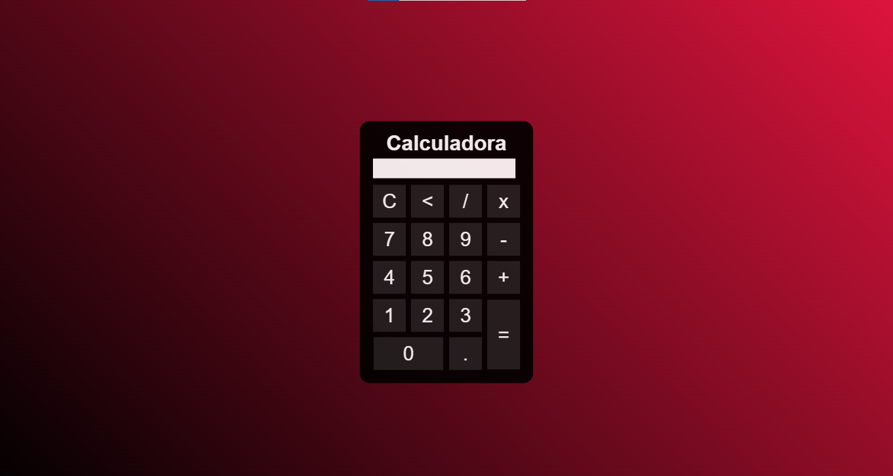

# Calculadora Web

Este é um projeto de uma calculadora simples desenvolvida com HTML, CSS e JavaScript. A calculadora permite realizar operações matemáticas básicas como soma, subtração, multiplicação e divisão.

## Tecnologias Utilizadas

- HTML
- CSS
- JavaScript

## Funcionalidades

- Adição
- Subtração
- Multiplicação
- Divisão
- Limpar tela

## Como Usar

1. Clone este repositório:
   ```sh
   git clone https://github.com/seu-usuario/calculadora.git
   ```
2. Abra o arquivo `index.html` em seu navegador.
3. Utilize os botões para realizar cálculos.

## Captura de Tela



## Melhorias Futuras

- Adicionar funcionalidades avançadas (exemplo: raiz quadrada, exponenciação)
- Criar um histórico de operações
- Melhorar a interface com animações e temas

## Contribuição

Sinta-se à vontade para contribuir com melhorias! Basta fazer um fork do repositório e enviar um pull request.


